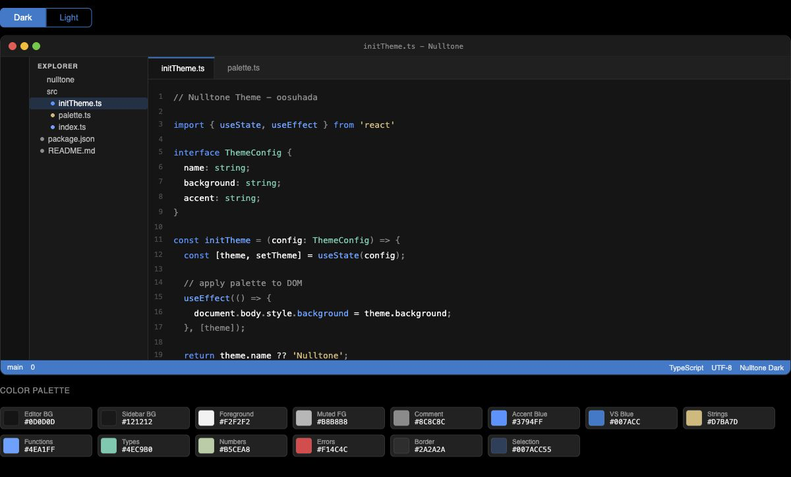
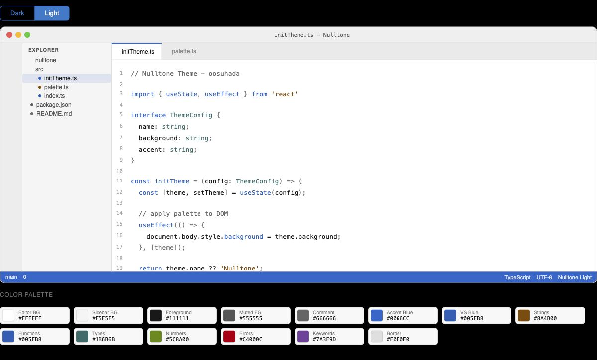

# Nulltone

Nulltone is a display-first VS Code color theme by `oosuhada`, designed to maximize clarity, contrast, and usable screen space on Mini LED, OLED, and MacBook displays.

## Why I Built It / 만든 이유

macOS evolved with a sleek, translucent Liquid Glass UI, but existing VS Code themes were all too vivid to match that system-level tone and manner. I built Nulltone to eliminate that visual disconnect and bring the translucent aesthetic and design language of modern macOS right into the editor.

macOS가 리퀴드 글라스(Liquid Glass)로 개편되면서 특유의 투명하고 세련된 UI로 바뀌었는데, VS Code에는 너무 vivid한 테마들뿐이라 톤앤매너가 전혀 맞지 않았습니다. 에디터만 따로 노는 이질감을 없애고, macOS의 투명한 감성과 자연스럽게 어우러지는 개발 환경을 만들기 위해 직접 제작했습니다.

Marketplace ID: `oosuhada.nulltone`

## Overview / 개요

Nulltone은 Mini LED·OLED·MacBook 디스플레이에서 장시간 코딩할 때 **중립적인 명암, 선명한 대비, 최소한의 포인트 컬러**를 유지하도록 설계한 VS Code 테마입니다. 흔한 청회색 계열 dark theme 대신 실제 검정에 가까운 surface와 읽기 쉬운 회색/흰색 계층을 사용하고, 색상은 syntax·focus·selection·Git·diagnostic처럼 의미가 필요한 곳에만 남깁니다.

- **Dark / Light / Glass Dark / Glass Light** 변형 제공
- Mini LED와 OLED에서 black level과 가독성을 살리는 display-first 설계
- VS Code 기본 UI와 어색하게 충돌하지 않는 절제된 accent
- 실제 코드 화면을 기준으로 한 dark/light preview 포함
- Marketplace ID: `oosuhada.nulltone`

이 프로젝트는 단순 색상 취향 저장소가 아니라, 디스플레이 특성과 장시간 개발 환경을 고려해 하나의 작은 개발자 도구 제품으로 정리한 작업입니다.

## Preview

<p align="center">
  
  
</p>

- **OS Nulltone Dark**: optimized for Mini LED and OLED displays with neutral black surfaces, clear white text, refined gray comments, and focused VS Code blue accents.
- **OS Nulltone Light**: optimized for bright environments and MacBook displays with clean white surfaces, readable dark text, and stronger token contrast.
- **OS Nulltone Glass Dark**: a neutral transparent dark variant for the Nulltone Glass Controller. Code and terminal surfaces remain more opaque than surrounding UI.
- **OS Nulltone Glass Light**: a neutral transparent light variant for automatic macOS light mode when Glass is enabled.

## Why Nulltone

Many dark coding themes use blue-gray surfaces. On Mini LED and OLED displays, those colors can make black areas look less crisp and reduce the sense of depth that these panels are capable of.

Nulltone takes a different approach. It keeps the base palette close to neutral black, gray, and white, then uses color only where it improves meaning: syntax, focus, selection, Git state, diagnostics, and primary UI actions.

The goal is not to make the editor colorful. The goal is to make the screen feel cleaner, sharper, and easier to read for long programming sessions.

## Themes

### OS Nulltone Dark

A dark theme for high-contrast modern displays.

- Neutral black surfaces without a blue-gray cast.
- Bright foreground text where the editor should actually read as white.
- Refined gray comments instead of classic green comments.
- VS Code blue for cursor, focus, selection, badges, and primary UI accents.
- Designed to feel crisp on Mini LED, OLED, and MacBook screens.

### OS Nulltone Light

A light theme for bright rooms, classrooms, and daytime coding.

- Clear white surfaces.
- Stronger syntax contrast than many soft light themes.
- Controlled accent colors that remain readable on bright backgrounds.
- Designed for users who switch between dark and light mode throughout the day.

### OS Nulltone Glass Dark / Light

Transparent variants for local use with the Nulltone Glass Controller.

- Keep the Nulltone achromatic base instead of blue-gray surfaces.
- Preserve automatic macOS dark/light switching through VS Code preferred themes.
- Use alpha only on structural surfaces, not token colors.
- Keep editor and terminal backgrounds more opaque than sidebars, tabs, and panels.
- Reserve VS Code blue for focus, cursor, selection, badges, and primary UI accents.

## Design Philosophy

Nulltone starts from achromatic space, but it is not colorless. Its color is edited down.

Most dark coding themes lean into blue-gray surfaces. On Mini LED and OLED displays, that can make the editor feel less black, less crisp, and visually heavier than intended. OS Nulltone Dark keeps the base palette between black and white without a blue cast, then reserves color for meaning: focus, selection, syntax, Git state, diagnostics, and UI accents.

The main accent follows the familiar VS Code blue family. It should feel native to the editor rather than decorative. Comments avoid the classic green retro look and use neutral gray instead, so code keeps a modern, technical tone.

OS Nulltone Light follows the same logic from the other side: white surfaces, dark readable text, and token colors with enough weight to survive real daylight and high-brightness screens.

## Palette Intent

- Neutral black and gray surfaces, without blue-gray bias.
- Bright foreground text where the editor should actually read as white.
- Refined gray comments instead of green comments.
- VS Code blue for cursor, focus, selection, badges, and primary UI accents.
- Saturated but controlled token colors for readability in light mode.
- High clarity on Mini LED, OLED, and MacBook displays.

## Recommended Usage

For the best experience, enable automatic system color mode detection in VS Code:

```jsonc
{
  "window.autoDetectColorScheme": true,
  "workbench.preferredDarkColorTheme": "OS Nulltone Dark",
  "workbench.preferredLightColorTheme": "OS Nulltone Light"
}
```

This lets VS Code follow macOS light and dark mode automatically.

For the local glass setup:

```jsonc
{
  "window.autoDetectColorScheme": true,
  "workbench.preferredDarkColorTheme": "OS Nulltone Glass Dark",
  "workbench.preferredLightColorTheme": "OS Nulltone Glass Light"
}
```

The normal Nulltone themes remain the safe fallback when Glass is off.

## Future Variants

Nulltone is designed as a family:

- `OS Nulltone Dark`
- `OS Nulltone Glass Dark`
- `OS Nulltone Light`
- `OS Nulltone Glass Light`
- `OS Nulltone Amber`
- `OS Nulltone Mono`

## Local Development

Open this folder in VS Code and run the extension development host:

1. Press `F5`.
2. Choose **OS Nulltone Dark**, **OS Nulltone Light**, **OS Nulltone Glass Dark**, or **OS Nulltone Glass Light** from the Color Theme picker.

The `reference/` directory is intentionally ignored by Git. It contains local study material from other open-source VS Code themes and is not packaged with Nulltone.

## Architecture & Topics / 아키텍처 및 주제

**Architecture / 아키텍처**<br>
[`design-token-system`](https://github.com/topics/design-token-system) · [`semantic-color-system`](https://github.com/topics/semantic-color-system) · [`theme-architecture`](https://github.com/topics/theme-architecture) · [`adaptive-color-system`](https://github.com/topics/adaptive-color-system) · [`accessibility-first-design`](https://github.com/topics/accessibility-first-design) · [`platform-aware-design`](https://github.com/topics/platform-aware-design)

**Core technologies / 핵심 기술**<br>
[`vscode-theme`](https://github.com/topics/vscode-theme) · [`liquid-glass`](https://github.com/topics/liquid-glass)

**Project context / 프로젝트 맥락**<br>
[`accessibility`](https://github.com/topics/accessibility) · [`color-theme`](https://github.com/topics/color-theme) · [`dark-theme`](https://github.com/topics/dark-theme) · [`developer-experience`](https://github.com/topics/developer-experience) · [`developer-tools`](https://github.com/topics/developer-tools) · [`light-theme`](https://github.com/topics/light-theme) · [`macos`](https://github.com/topics/macos) · [`mini-led`](https://github.com/topics/mini-led) · [`oled`](https://github.com/topics/oled) · [`syntax-highlighting`](https://github.com/topics/syntax-highlighting) · [`theme`](https://github.com/topics/theme) · [`ui-design`](https://github.com/topics/ui-design) · [`visual-studio-code`](https://github.com/topics/visual-studio-code)

**Implementation stack / 구현 스택**<br>
[`vscode-extension`](https://github.com/topics/vscode-extension)
